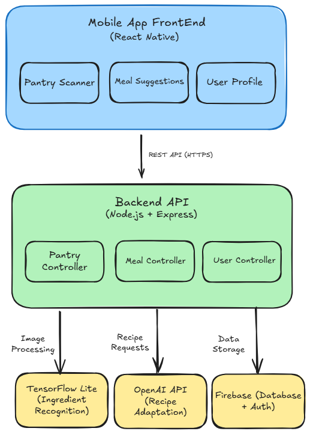

# MealMind System Architecture

## Overview

MealMind is a mobile-first meal planning application built on a three-tier architecture: React Native frontend, Node.js backend, and Firebase database. The system leverages AI/ML for recipe adaptation (OpenAI GPT-4) and ingredient recognition (TensorFlow Lite).


## High-Level Architecture Overview


*Visual representation of MealMind's component architecture and data flow*


## Frontend Architecture

### Technology Stack: React Native

**Why React Native:**
- Cross-platform development (single codebase for iOS & Android)
- Native camera access for pantry scanning
- Native performance (60fps UI)
- JavaScript consistency with backend
- TensorFlow.js support for on-device ML

### Core Components

#### 1. Pantry Scanner (`/components/PantryScanner`)
**Responsibility:** Capture and process pantry photos

**Features:**
- Camera interface with capture button
- Image compression before upload
- Loading state during processing
- Editable ingredient list after recognition

**Tech:**
- React Native Camera API
- Image compression library (react-native-image-resizer)
- Redux for state management

#### 2. Meal Suggestion Engine (`/components/MealSuggestions`)
**Responsibility:** Display meal options from backend

**Features:**
- Card-based UI with recipe images
- Prep time, macros, difficulty level
- "Cook This" / "Skip" actions
- Swipe gestures for quick decisions

**Tech:**
- React Native FlatList (optimized rendering)
- React Navigation for recipe details
- Redux Toolkit for meal state

#### 3. Constraint Mode Interface (`/components/ConstraintMode`)
**Responsibility:** Handle "I want X but missing Y" scenarios

**Features:**
- Search input for desired meal
- Real-time pantry checking
- Ingredient alert badges
- Adapted recipe suggestions

**User Flow:**
1. User types "fried plantain and eggs"
2. App checks Firebase for current pantry
3. Detects "only 2 tbsp oil" (insufficient)
4. Shows alert + adapted suggestions
5. Displays "stuffed plantain boats" alternative

#### 4. User Profile Manager (`/components/Profile`)
**Responsibility:** Store preferences and dietary goals

**Features:**
- Dietary restrictions (vegan, keto, allergies)
- Fitness goals (weight loss, muscle gain)
- Meal history and favorites
- Taste preference learning

### State Management: Redux Toolkit

**Slices:**
- `ingredientsSlice`: Current pantry inventory
- `mealsSlice`: Suggested meals, history, favorites
- `userSlice`: Profile, auth state, preferences
- `uiSlice`: Loading states, modals, alerts


## Backend Architecture

### Technology Stack: Node.js + Express

**Why Node.js:**
- JavaScript everywhere (frontend-backend consistency)
- Asynchronous I/O (perfect for AI API calls)
- Fast prototyping with Express framework
- Rich npm ecosystem (image processing, Firebase SDK, OpenAI client)

### API Endpoints

#### **POST** `/api/pantry/scan`
**Purpose:** Process pantry photo and extract ingredients

**Request:**
```json
{
  "userId": "user_123",
  "image": "base64_encoded_image_string",
  "timestamp": "2025-11-08T10:30:00Z"
}
```

**Response:**
```json
{
  "success": true,
  "ingredients": [
    {
      "name": "plantain",
      "quantity": "3 pieces",
      "confidence": 0.94,
      "expiry": null
    },
    {
      "name": "eggs",
      "quantity": "6 pieces",
      "confidence": 0.97,
      "expiry": "2025-11-15"
    },
    {
      "name": "vegetable oil",
      "quantity": "2 tbsp",
      "confidence": 0.89,
      "expiry": null
    }
  ]
}
```
**Processing:**
1. Receive base64 image
2. Decode and save temporarily
3. Send to TensorFlow Lite model
4. Run OCR on package labels (Tesseract.js)
5. Combine results and format response
6. Save to Firebase under user's pantry
7. Delete temporary image


#### **POST** `/api/meals/suggest`
**Purpose:** Get meal suggestions from current pantry

**Request:**
```json
{
  "userId": "user_123",
  "mood": "lazy",
  "dietaryGoals": "weight_loss",
  "prepTimeMax": 30
}
```

**Response:**
```json
{
  "suggestions": [
    {
      "id": "meal_001",
      "name": "Scrambled Eggs with Plantain",
      "prepTime": 15,
      "difficulty": "easy",
      "macros": {
        "calories": 320,
        "protein": 18,
        "carbs": 35,
        "fat": 12
      },
      "ingredients": ["eggs", "plantain", "oil"],
      "steps": ["Step 1...", "Step 2..."]
    }

  ]
}
```

**Processing:**
1. Fetch user's pantry from Firebase
2. Fetch user preferences (allergies, diet type)
3. Build OpenAI prompt with context
4. Call OpenAI API for 3 meal suggestions
5. Calculate macros for each meal
6. Return formatted response for 3 meal options with recipes, macros, prep time


#### **POST** `/api/meals/adapt`
**Purpose:** Adapt recipe when ingredients are incomplete (Constraint Mode)

**Request:**
```json
{
  "userId": "user_123",
  "desiredMeal": "fried plantain and eggs",
  "currentPantry": [
    {"name": "plantain", "quantity": "3 pieces"},
    {"name": "eggs", "quantity": "6 pieces"},
    {"name": "oil", "quantity": "2 tbsp"}
  ]
}
```

**Response:**
```json
{
  "originalMeal": "fried plantain and eggs",
  "missingIngredients": [
    {
      "item": "oil",
      "needed": "1 cup (for deep frying)",
      "available": "2 tbsp"
    }
  ],
  "adaptedSuggestion": {
    "name": "Stuffed Plantain Boats",
    "adaptation": "Boil plantain instead of frying, use minimal oil for roasting",
    "prepTime": 25,
    "macros": {...},
    "steps": [...]
  }
}
```

**Processing:**
1. Parse desired meal
2. Query Firebase for user's pantry
3. Identify missing/insufficient ingredients
4. Call OpenAI with adaptation prompt:
```
   "User wants: fried plantain and eggs
    Available: plantain (3), eggs (6), oil (2 tbsp only)
    Problem: Not enough oil for deep frying
    Task: Suggest creative adaptation using available ingredients"
```
5. Format OpenAI response
6. Return adapted recipe


### AI Integration: OpenAI API

**Prompt Engineering Strategy:**
```javascript
const buildMealPrompt = (pantry, preferences) => {
  return `You are a creative chef assistant helping with meal planning.

User's Available Ingredients:
${pantry.map(i => `- ${i.name} (${i.quantity})`).join('\n')}

User Preferences:
- Dietary Goals: ${preferences.dietaryGoals}
- Allergies: ${preferences.allergies.join(', ')}
- Mood: ${preferences.mood}
- Max Prep Time: ${preferences.prepTimeMax} minutes

Task: Suggest 3 meals that:
1. Use ONLY the available ingredients
2. Respect dietary restrictions
3. Match the user's mood and time constraints
4. Include macros (calories, protein, carbs, fat)

Return JSON format:
{
  "meals": [
    {
      "name": "...",
      "prepTime": ...,
      "ingredients": [...],
      "steps": [...],
      "macros": {...}
    }
  ]
}`;
};
```

**Why GPT-4:**
- Understands nuanced cooking instructions
- Creative adaptation (not just keyword matching)
- Consistent JSON output with proper formatting
- Handles edge cases (substitutions, allergies)


## Database Architecture

### Technology Stack: Firebase Realtime Database

**Why Firebase:**
- Real-time synchronization (pantry updates instantly)
- Built-in authentication (Google, email/password)
- NoSQL flexibility (ingredients have variable fields)
- Serverless (auto-scaling, no infrastructure management)
- Free tier: 10GB storage, 50K concurrent connections

### Data Schema
```json
{
  "users": {
    "user_123": {
      "profile": {
        "email": "user@example.com",
        "createdAt": "2025-11-01T08:00:00Z",
        "dietaryGoals": "weight_loss",
        "allergies": ["peanuts"],
        "favoriteCuisines": ["Nigerian", "Italian"]
      },
      "pantry": {
        "ingredient_001": {
          "name": "plantain",
          "quantity": "3 pieces",
          "unit": "pieces",
          "addedDate": "2025-11-05",
          "expiryDate": "2025-11-12",
          "category": "produce"
        },
        "ingredient_002": {
          "name": "eggs",
          "quantity": "6",
          "unit": "pieces",
          "addedDate": "2025-11-06",
          "expiryDate": "2025-11-20",
          "category": "protein"
        }
      },
      "mealHistory": {
        "meal_001": {
          "name": "Stuffed Plantain Boats",
          "cookedDate": "2025-11-07T12:30:00Z",
          "rating": 5,
          "ingredientsUsed": ["plantain", "eggs", "oil"],
          "prepTime": 25,
          "wasAdapted": true
        }
      },
      "preferences": {
        "preferQuickMeals": true,
        "avoidSpicy": false,
        "breakfastTime": "07:00",
        "lunchTime": "13:00",
        "dinnerTime": "19:00"
      }
    }
  }
}
```

**Why NoSQL (Not SQL):**
- Ingredient quantities vary (some in "tbsp", others in "pieces", others in "grams")
- Schema flexibility for new features (e.g., adding "mood tracking")
- No complex joins needed (user data is self-contained)
- Faster reads for mobile apps (direct path access)


## Component Communication Flow

### Scenario: User Scans Pantry
```
┌─────────────────────────────────────────────────────────────┐
│ STEP 1: User Action                                         │
│ User opens Pantry Scanner → taps camera → captures photo    │
└──────────────────────┬──────────────────────────────────────┘
                       │
                       ▼
┌─────────────────────────────────────────────────────────────┐
│ STEP 2: Frontend Processing                                 │
│ - React Native compresses image to 1024x1024               │
│ - Converts to base64                                        │
│ - Shows loading spinner                                     │
│ - Sends POST /api/pantry/scan                              │
└──────────────────────┬──────────────────────────────────────┘
                       │
                       ▼
┌─────────────────────────────────────────────────────────────┐
│ STEP 3: Backend Processing                                  │
│ - Receives base64 image                                     │
│ - Decodes and saves temporarily                             │
│ - Runs TensorFlow Lite model (ingredient detection)         │
│ - Runs Tesseract OCR (package labels)                       │
│ - Combines results, formats JSON                            │
└──────────────────────┬──────────────────────────────────────┘
                       │
                       ▼
┌─────────────────────────────────────────────────────────────┐
│ STEP 4: Database Update                                     │
│ - Backend saves ingredients to Firebase                     │
│ - Firebase triggers real-time sync                          │
│ - Mobile app receives update via WebSocket                  │
└──────────────────────┬──────────────────────────────────────┘
                       │
                       ▼
┌─────────────────────────────────────────────────────────────┐
│ STEP 5: Frontend Update                                     │
│ - Redux updates ingredientsSlice                            │
│ - UI re-renders with new ingredient list                    │
│ - User can edit/confirm ingredients                         │
│ - Loading spinner disappears                                │
└─────────────────────────────────────────────────────────────┘
```


### Scenario: Constraint Mode Adaptation
```
1. USER ACTION:
   └─► Opens "Constraint Mode"
   └─► Types: "fried plantain and eggs"

2. FRONTEND:
   └─► Fetches current pantry from Redux state
   └─► Sends POST /api/meals/adapt
       Body: {desiredMeal, currentIngredients, userId}

3. BACKEND:
   └─► Receives request
   └─► Queries Firebase for user's pantry inventory
   └─► Detects: oil quantity = "2 tbsp" (insufficient for frying)
   └─► Calls OpenAI API with adaptation prompt
   └─► OpenAI returns: "stuffed plantain boats" recipe
   └─► Backend formats response with macros, prep time
   └─► Returns JSON to frontend

4. FRONTEND:
   └─► Displays adapted recipe with:
       • Alert: "Not enough oil for frying"
       • Suggestion: "Try stuffed plantain boats instead!"
       • Recipe card with image, steps, macros

5. USER ACTION:
   └─► Taps "Cook This"
   └─► Frontend marks ingredients as used
   └─► Updates pantry quantities in Firebase
   └─► Logs meal in mealHistory with timestamp
```

## Why This Architecture is Technically Feasible

### 1. Proven Technologies at Scale

**React Native:**
- Used by: Instagram (1B+ users), Uber Eats, Discord
- Proven performance for image-heavy apps
- Mature ecosystem (8+ years)

**Node.js + Express:**
- Used by: Netflix (handles 200M+ API requests/day), PayPal, LinkedIn
- Handles async AI calls efficiently
- Fast development cycle

**Firebase:**
- Powers apps with 100M+ users (Duolingo, Lyft)
- 99.95% uptime SLA
- Real-time sync handles 50K concurrent connections

**OpenAI API:**
- Production-ready (used by Notion AI, Canva)
- 99.9% uptime
- Consistent response times (<2s)


### 2. Cost-Effective MVP Budget
- Firebase free tier sufficient for first 1K users
- OpenAI API: ~$50/month for 2.5K meal suggestions
- No server costs (serverless architecture)


### 3. Realistic Development Timeline

**Phase 1 (Weeks 1-2): Frontend Foundation**
- React Native setup + navigation
- Camera integration
- Basic UI components
- Redux state management

**Phase 2 (Weeks 3-4): Backend Core**
- Express API setup
- Firebase integration
- OpenAI API integration
- Basic meal suggestion endpoint

**Phase 3 (Weeks 5-6): ML Integration**
- TensorFlow Lite model training (1K food images)
- OCR integration (Tesseract.js)
- Ingredient recognition accuracy tuning

**Phase 4 (Weeks 7-8): Polish & Testing**
- Constraint Mode implementation
- Bug fixes, performance optimization
- User testing with 20 beta users
- App Store submission

**Total: 2 months with 2 cracked developers (1 frontend, 1 backend)**


### 4. Graceful Degradation Strategy

**If computer vision fails:**
→ Fall back to manual ingredient input (still usable)

**If OpenAI API is slow/down:**
→ Show cached recipes from previous suggestions (offline mode)

**If Firebase is down:**
→ Local storage saves pantry temporarily, syncs when back online

**If user has poor internet:**
→ TensorFlow Lite runs on-device (no upload needed for recognition)

## Platform Strategy

### Phase 1 (MVP): Mobile-First
MealMind launches as a React Native mobile application for iOS and Android. This focuses development on the core use case: users in their kitchen deciding what to cook.

**Why mobile-first:**
- Camera access is native and seamless
- Push notifications for meal reminders work better
- 80% of meal decisions happen on mobile devices
- Faster MVP timeline (2 months vs. 3+ for mobile + web)

### Phase 2 (Post-Launch): Web Companion App
After validating mobile product-market fit, we'll build a React web app for:
- Meal planning from desktop (Sunday meal prep planning)
- Viewing shopping lists on laptop while ordering groceries
- Sharing recipes via web links (social/viral growth)

**Shared Backend:** Both mobile and web will use the same Node.js API.

## Technical Risks & Mitigation

| Risk | Likelihood | Impact | Mitigation |
|------|-----------|--------|------------|
| OpenAI API rate limits | Medium | High | Implement request queue, cache common recipes, set max requests/user |
| Ingredient recognition accuracy <80% | High | Medium | Allow manual editing, improve model with user feedback loop |
| High latency on 3G networks | Medium | Medium | Compress images aggressively, show progressive loading states |
| Firebase costs spike at scale | Low | High | Monitor usage, plan migration to self-hosted MongoDB at 10K users |
| OpenAI API cost explosion | Medium | High | Set monthly budget caps, optimize prompts to reduce token usage |

## Future Enhancements (Post-MVP)

1. **Voice Input:** "Hey MealMind, what can I make for dinner?"
2. **Social Sharing:** Send recipes to friends, collaborative meal planning
3. **Grocery Integration:** Auto-order missing ingredients via Instacart API
4. **Meal Prep Mode:** Plan entire week based on one grocery trip
5. **AR Expiry Scanning:** Point camera at fridge, see expiry dates highlighted


## Conclusion

MealMind's architecture balances **speed to market** (2-month MVP) with **technical soundness** (proven stack, graceful degradation). 

The constraint-based recipe adaptation powered by GPT-4 is the **technical moat**. Competitors using simple keyword matching can't replicate the creative problem-solving our system provides.

By leveraging existing technologies (React Native, Firebase, OpenAI) and focusing on a single painful user problem (meal decision fatigue from limited ingredients), the system is both **feasible to build** and **defensible at scale**.


**Document Version:** 1.0  
**Last Updated:** November 8, 2025  
**Author:** Molokwu Chibuzor ([@jaycarlx](https://github.com/jaycarlx))